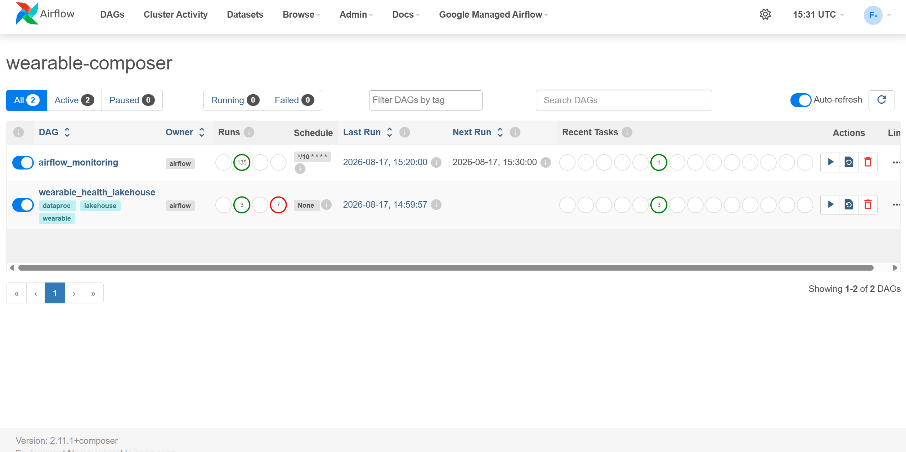
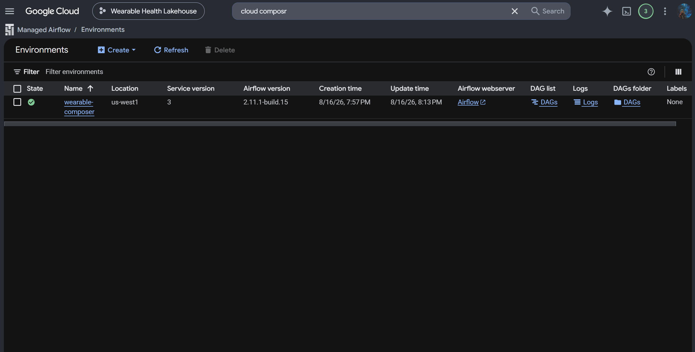
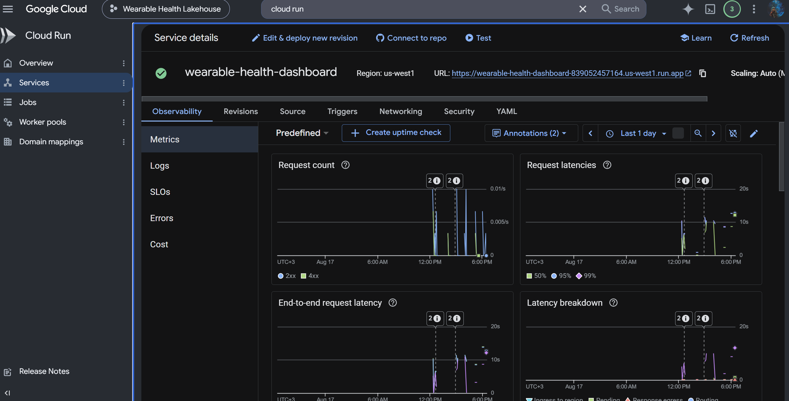
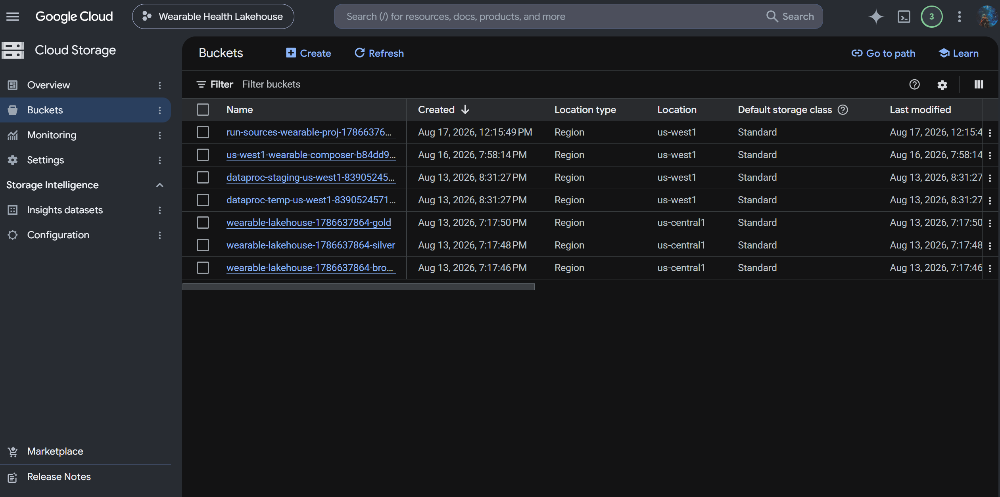
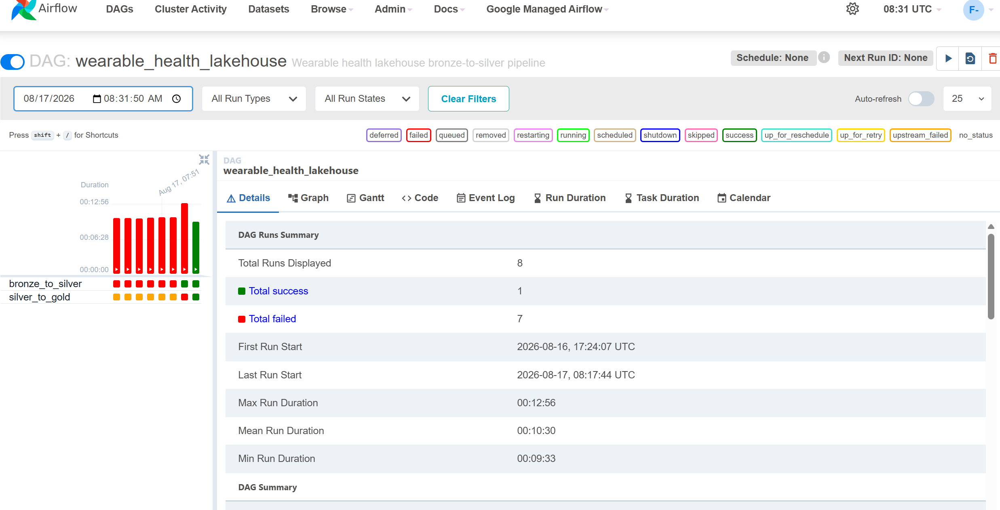
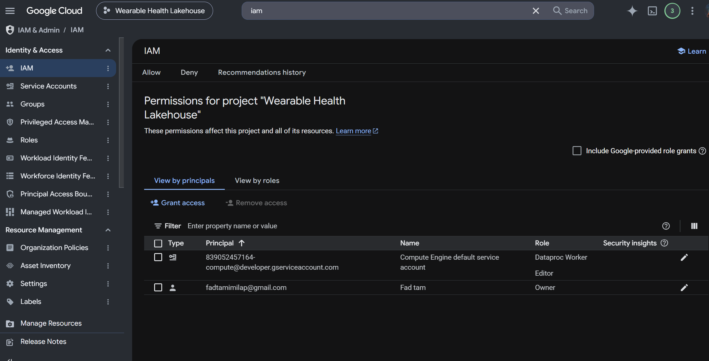

# Wearable Health Lakehouse

**Tuwaiq Academy Capstone Project**

Serverless GCP lakehouse for wearable health data, designed as a polished portfolio project for Tuwaiq Academy.

## Why this project stands out

- Fully serverless on GCP
- Bronze / silver / gold architecture
- Airflow orchestration with Dataproc Serverless transforms
- BigQuery analytics layer
- Built for a strong technical portfolio demo

## Stack

- Cloud Storage for bronze, silver, and gold zones
- Cloud Composer / Airflow for orchestration
- Dataproc Serverless for Spark transforms
- BigQuery for the final analytics layer
- Secret Manager, Cloud Logging, and Cloud Monitoring for operations

## Project layout

- `dags/` - Airflow DAGs
- `scripts/` - Dataproc Serverless Spark jobs
- `docs/` - architecture and implementation notes
- `infra/` - IaC placeholders
- `tests/` - smoke tests

## Pipeline

1. Bronze data lands in Cloud Storage.
2. Dataproc Serverless transforms bronze to silver.
3. Dataproc Serverless transforms silver to gold.
4. Gold is loaded into BigQuery for analytics.

## Portfolio highlights

- Clear Tuwaiq Academy branding
- End-to-end serverless GCP workflow
- Reproducible bronze / silver / gold design
- Operational visibility through logging and monitoring

## Demo screenshots

